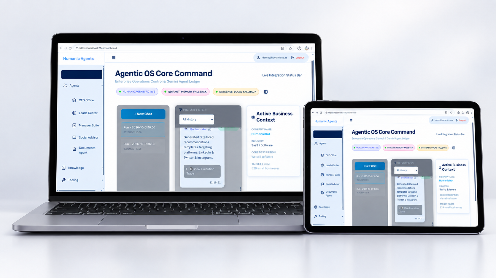
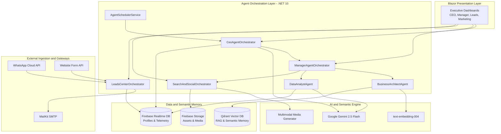
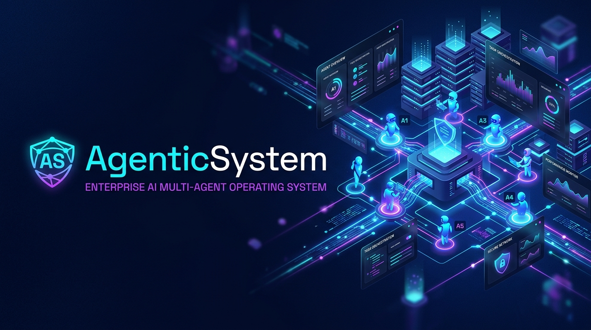

# AgenticSystem — Enterprise AI Multi-Agent Operating System

<div align="center">



[](https://dotnet.microsoft.com/)
[](https://dotnet.microsoft.com/apps/aspnet/web-apps/blazor)
[](https://github.com/microsoft/semantic-kernel)
[](https://ai.google.dev/)
[](https://qdrant.tech/)
[](https://firebase.google.com/)

**An autonomous, multi-agent enterprise platform built with .NET 10, Microsoft Semantic Kernel, Google Gemini, and Qdrant Vector Search to orchestrate business workflows, marketing pipelines, analytical telemetry, and customer acquisition.**

[Key Highlights](#-key-capabilities) • [System Architecture](#-system-architecture) • [Getting Started](#-getting-started) • [Configuration](#-configuration-appsettingsjson) • [Agent Roster](#-autonomous-agent-roster) • [Tech Stack](#-technical-stack)

</div>

---

## 📌 Executive Summary

**AgenticSystem** is a next-generation corporate operating system powered by hierarchical autonomous AI agents. Rather than treating Large Language Models (LLMs) as isolated chat interfaces, AgenticSystem deploys specialized role-driven agents (CEO, Operations Manager, Business Architect, Data Analyst, Social Media Director, and Lead Acquisition Specialist) that communicate, formulate strategy, synthesize multimedia assets, and execute real-world operations in real time.

Built on cutting-edge **.NET 10 Interactive Server Blazor** and **Microsoft Semantic Kernel**, the platform connects long-term episodic memory via **Qdrant Vector DB**, live multi-tenant state through **Firebase Realtime Database**, and omni-channel external webhooks (WhatsApp Cloud API & Web Lead Forms).

---


## ⚡ Key Capabilities

- 🧠 **Hierarchical Agent Orchestration**: Multi-tier executive agent decision loops where strategic goals cascade from the CEO agent to managers and specialist domain agents.
- 🔍 **Vector Memory & RAG (Retrieval-Augmented Generation)**: High-speed semantic indexing and document retrieval powered by **Qdrant** and Google embeddings (`text-embedding-004`).
- 🎨 **Autonomous Multimedia Marketing Studio**: Automatic generation of targeted image posters and script-driven video campaigns utilizing generative multimodal AI pipelines.
- 📱 **Omni-Channel Lead Acquisition & Conversational CRM**: Integrated WhatsApp Cloud API webhooks and real-time website lead intake with autonomous agent qualification and automated follow-ups.
- 📊 **Executive & Departmental Dashboards**: Responsive, real-time Blazor server dashboards for CEO oversight, business knowledgebases, analytics telemetry, billing, and social media dispatch.
- ⏱️ **Resilient Background Automation**: Native `IHostedService` agent scheduler for proactive background monitoring, recurring data analysis, and task resolution.

---

## 🏛 System Architecture

The following diagram illustrates how incoming events, memory layers, and autonomous agents interact within the platform:



---

## 🤖 Autonomous Agent Roster

| Agent / Service | Core Responsibility | Technologies & Integrations |
| :--- | :--- | :--- |
| **👔 CEO Agent** | Synthesizes organizational goals, reviews cross-department performance, and issues directives. | Semantic Kernel, Gemini 2.5 Flash, Firebase Profile |
| **📋 Manager Agent** | Deconstructs corporate directives into actionable unit tasks and oversees agent telemetry. | Semantic Kernel, System Automation Plugins |
| **📐 Business Architect** | Models business capabilities, market positioning, and domain knowledge graphs. | Qdrant Vector Memory, Knowledge Base Services |
| **📈 Data Analyst** | Evaluates real-time operational metrics, tracks KPIs, and surfaces strategic insights. | Realtime Database Aggregators, Vector RAG |
| **📢 Social & Creative Agent** | Synthesizes viral marketing copy, schedules multi-platform posts, and drives digital engagement. | Gemini multimodal, Video & Image Generation Services |
| **🎯 Lead Specialist** | Ingests inbound inquiries from web forms and WhatsApp, qualifies leads, and triggers nurture flows. | WhatsApp Webhooks, Leads Center Orchestrator, MailKit |



---

## 🚀 Getting Started

### 📋 Prerequisites

Before running the application, ensure you have the following installed and available:

1. **[.NET 10 SDK](https://dotnet.microsoft.com/download)** (v10.0 or higher)
2. **[Qdrant Vector Database](https://qdrant.tech/documentation/quick-start/)** (Local Docker instance or Qdrant Cloud)
   ```bash
   docker run -p 6333:6333 -p 6334:6334 qdrant/qdrant
   ```
3. **[Google AI Studio API Key](https://aistudio.google.com/)** (Gemini 2.5 Flash access)
4. **[Firebase Project](https://firebase.google.com/)** (Realtime Database & Authentication enabled)

---

### ⚙️ Configuration (`appsettings.json`)

> [!IMPORTANT]
> **Database & LLM Credentials Requirement:**
> To run the system, you **must configure your LLM keys and database endpoints** in `appsettings.json` (or `appsettings.Development.json`).

Open `appsettings.json` in the root project folder and populate your service credentials:

```json
{
  "Logging": {
    "LogLevel": {
      "Default": "Information",
      "Microsoft.AspNetCore": "Warning"
    }
  },
  "AllowedHosts": "*",
  "AiConfig": {
    "GeminiApiKey": "YOUR_GOOGLE_GEMINI_API_KEY",
    "FirebaseApiKey": "YOUR_FIREBASE_WEB_API_KEY",
    "GeminiModelId": "gemini-2.5-flash",
    "EmbeddingModelId": "text-embedding-004",
    "QdrantHost": "localhost",
    "QdrantPort": 6333,
    "FirebaseUrl": "https://YOUR_PROJECT_ID-default-rtdb.firebaseio.com/",
    "FirebaseProfilesUrl": "https://YOUR_PROJECT_ID-default-rtdb.firebaseio.com/profiles",
    "FirebaseStorageBucket": "YOUR_PROJECT_ID.appspot.com"
  }
}
```

#### Configuration Keys Reference

| Key | Description | Example / Default |
| :--- | :--- | :--- |
| `GeminiApiKey` | Google AI Gemini API authentication key | `AIzaSy...` |
| `FirebaseApiKey` | Firebase Web API key for Auth & Database REST operations | `AIzaSy...` |
| `GeminiModelId` | Target Gemini LLM for reasoning and agent planning | `gemini-2.5-flash` |
| `EmbeddingModelId` | Target embeddings model for semantic vector store | `text-embedding-004` |
| `QdrantHost` | Host address of the Qdrant vector database | `localhost` |
| `QdrantPort` | HTTP port for Qdrant vector database | `6333` |
| `FirebaseUrl` | Root endpoint of the Firebase Realtime Database | `https://<id>.firebaseio.com/` |
| `FirebaseProfilesUrl` | Sub-node endpoint for multi-tenant enterprise profiles | `https://<id>.firebaseio.com/profiles` |
| `FirebaseStorageBucket`| Firebase Cloud Storage bucket for generated assets | `<id>.appspot.com` |

---

### 🏃 Running the Application

1. **Clone the repository:**
   ```bash
   git clone https://github.com/your-username/AgenticSystem.git
   cd AgenticSystem
   ```

2. **Restore NuGet dependencies:**
   ```bash
   dotnet restore
   ```

3. **Launch the development server:**
   ```bash
   dotnet run
   ```

4. **Access the portal:**
   Open your browser and navigate to:
   ```text
   https://localhost:7196  (or http://localhost:5081)
   ```

---

## 🛠 Technical Stack

```
AgenticSystem
├── Framework:            .NET 10.0 (C# 13, ASP.NET Core)
├── Frontend:             Blazor Interactive Server & Modern Vanilla CSS
├── Agent Engine:         Microsoft Semantic Kernel (v1.77.0)
├── LLM Provider:         Google Gemini 2.5 Flash via Google.GenAI & SK Connector
├── Vector Database:      Qdrant Memory Connector (RAG & Semantic Embeddings)
├── Cloud & Realtime:     Firebase Database .NET & Firebase Authentication
├── Storage:              Firebase Cloud Storage (Media Artifacts)
├── Messaging / Webhooks: WhatsApp Cloud API & REST Webhooks
└── Communications:       MailKit (Automated SMTP Email Distribution)
```

---

## 📂 Project Structure

```text
AgenticSystem/
├── assets/                       # Brand and architectural graphics
│   └── agentic_system_banner.png # Hero README showcase banner
├── Components/                   # Blazor Presentation Layer
│   ├── Layout/                   # Navigation, Sidebars & Master Layouts
│   └── Pages/                    # Executive Dashboards & Department Consoles
│       ├── CeoDashboard.razor    # Strategic Oversight & Directives
│       ├── ManagerConsole.razor  # Task Allocation & Operational Tracking
│       ├── SocialMediaPosts.razor# AI Marketing Campaign Dispatcher
│       ├── ImagePosters.razor    # Generative Poster Visuals
│       ├── VideoAds.razor        # Generative Video Ad Prompts & Scripts
│       ├── Leads/                # CRM, Inbound Inquiries & Qualification
│       └── BillingDashboard.razor# Usage, Token Tracking & Subscriptions
├── Data/                         # Data transfer objects & entity models
├── Plugins/                      # Semantic Kernel automation skills & plugins
├── Services/                     # Core Business Logic & Orchestrators
│   ├── AgentOrchestrator.cs      # Core Agent Pipeline Coordination
│   ├── CeoAgentOrchestrator.cs   # Executive Strategy Synthesizer
│   ├── ManagerAgentOrchestrator.cs
│   ├── BusinessKnowledgeService.cs
│   ├── QdrantMemoryService.cs    # Semantic RAG & Vector Embeddings
│   ├── Firebase*Service.cs       # Auth, Profile, Storage & Realtime DB
│   └── WhatsappService.cs        # Meta WhatsApp Webhook Pipeline
├── appsettings.json              # Primary System Configuration
└── Program.cs                    # Dependency Injection & Pipeline Config
```

---

## 🔒 Security & Best Practices

- **Zero Hardcoded Secrets**: All private keys, database URLs, and API credentials should reside in `appsettings.json` or environment variables / User Secrets. Never commit production keys to source control.
- **Webhook Token Verification**: WhatsApp webhooks implement cryptographic challenge verification (`hub.verify_token` and `hub.challenge`).
- **Antiforgery Protection**: Blazor Interactive Server endpoints are secured with built-in antiforgery middleware.

---

## 📄 License

This project is licensed under the terms described in the [LICENSE.txt](./LICENSE.txt) file.

<div align="center">
  <sub>Developed for enterprise multi-agent workflows. Designed for scale, modularity, and real-time business intelligence.</sub>
</div>
